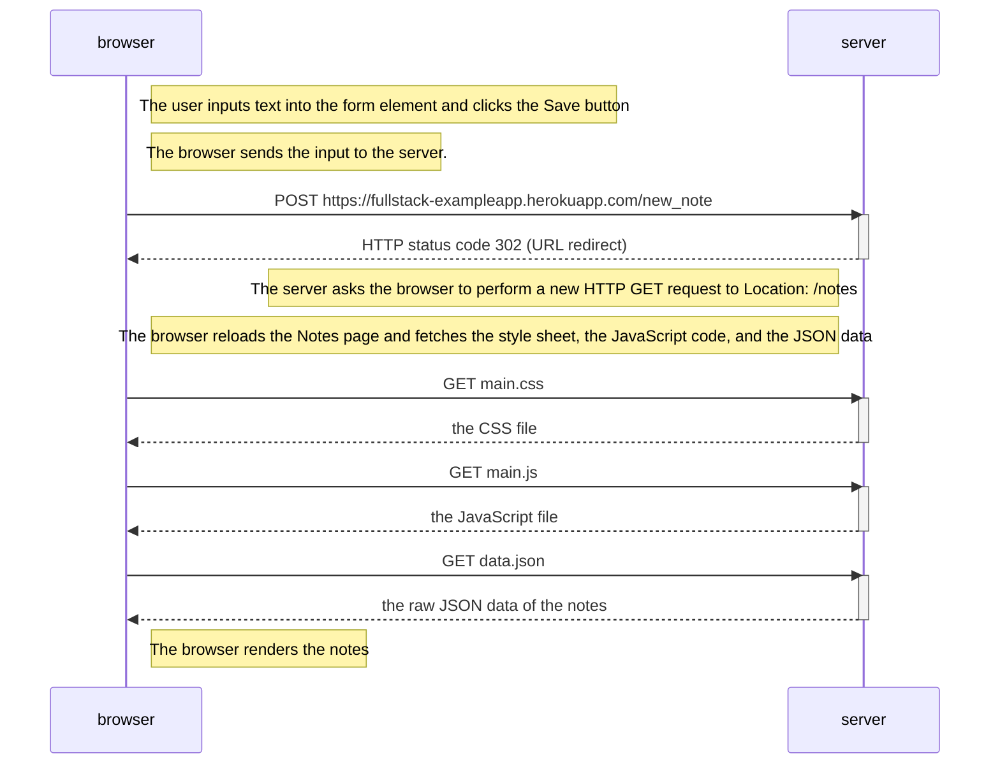

```mermaid
sequenceDiagram
    participant browser
    participant server

    Note right of browser: The user inputs text into the form element and clicks the Save button
    Note right of browser: The browser sends the input to the server.

    browser->>server: POST https://fullstack-exampleapp.herokuapp.com/new_note
    activate server
    server-->>browser: HTTP status code 302 (URL redirect)
    deactivate server

    Note left of server: The server asks the browser to perform a new HTTP GET request to Location: /notes

    Note right of browser: The browser reloads the Notes page and fetches the style sheet, the JavaScript code, and the JSON data
    
    browser->>server: GET main.css
    activate server
    server-->>browser: the CSS file
    deactivate server

    browser->>server: GET main.js
    activate server
    server-->>browser: the JavaScript file
    deactivate server

    browser->>server: GET data.json
    activate server
    server-->>browser: the raw JSON data of the notes
    deactivate server

    Note right of browser: The browser renders the notes
```