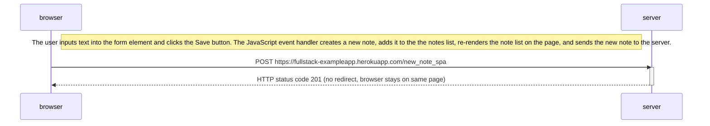

```mermaid
sequenceDiagram
    participant browser
    participant server

    Note right of browser: The user inputs text into the form element and clicks the Save button. The JavaScript event handler creates a new note, adds it to the the notes list, re-renders the note list on the page, and sends the new note to the server.

    browser->>server: POST https://fullstack-exampleapp.herokuapp.com/new_note_spa
    activate server
    server-->>browser: HTTP status code 201 (no redirect, browser stays on same page)
    deactivate server
```